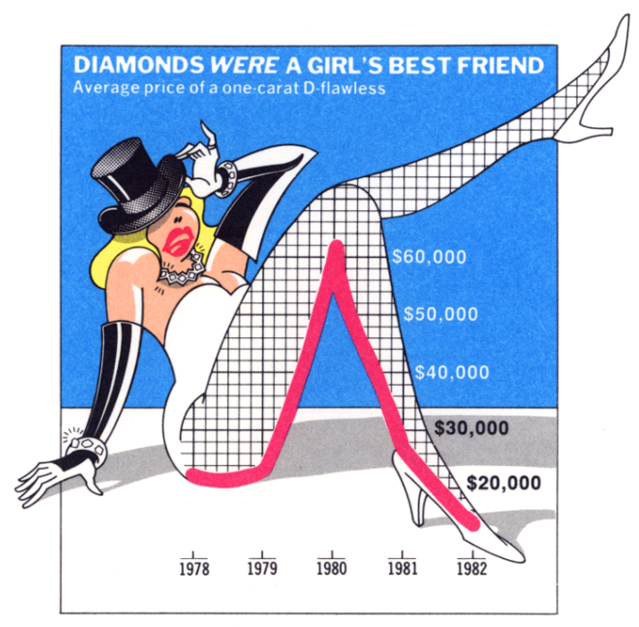
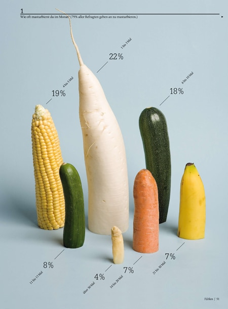
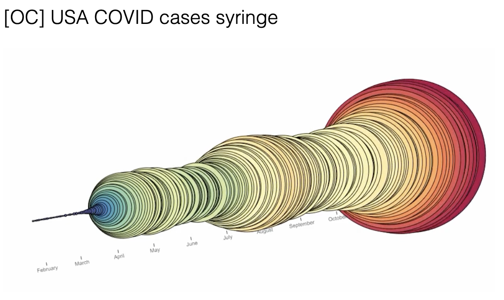
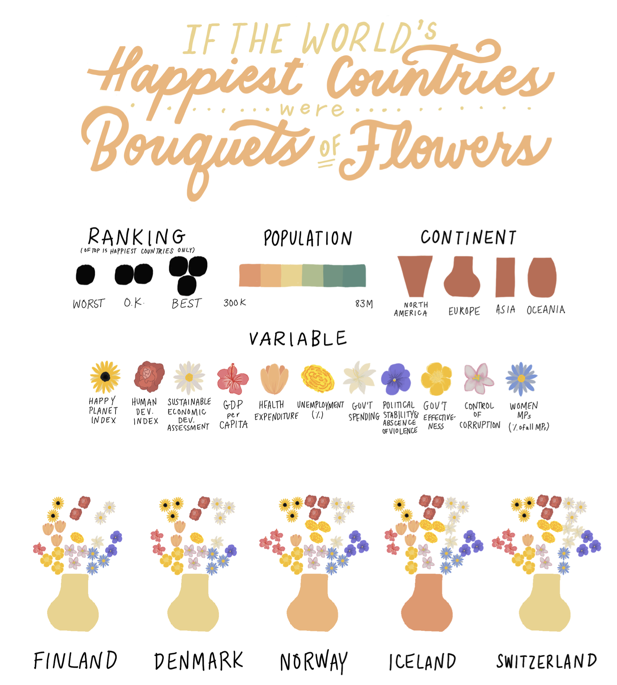

# Embracing the Drifting Mind for Better Visualization

Have you heard of the [attention economy](https://www.humanetech.com/youth/the-attention-economy)? Our attention is one of our most valuable assets. Marketing, media, advertising, apps, notifications: it seems like everyone would like a bite of our consciousness, if only for a second. And with quick paced entertainment like TikTok videos, YouTube Shorts and Instagram Reels, [the average attention span has diminished](https://jolt.richmond.edu/2024/03/06/tiktok-brain-can-we-save-childrens-attention-spans). Studies show that [the average attention span has reduced from 2.5 minutes in 2003 to just 40 seconds in 2025](https://www.nationalgeographic.com/health/article/attention-spans-shrinking-how-to-regain). 

>**So what if you’re the person asking for attention?** 

>**How can we pull someone’s attention to information we are hoping they will care about?**

>**How can we compete with the noise of everything going on in someone’s head?**

In [*Mind Drifts, Data Shifts: Utilizing Mind Wandering to Track the Evolution of User Experience With Data Visualizations*](https://ieeexplore-ieee-org.proxy.ulib.uits.iu.edu/document/10669803), researchers Anjana Arunkumar, Lace Padilla, and Chris Bryan ask these kinds of questions. By tracking participant’s real-time cognitive shifts when viewing visualizations, they sought to understand why attention lapses, how visualizations can capture that fleeting attention, and how we can even embrace mind wandering to make viewers care about a topic. 

## The Study

The study asked 106 graduate students at Arizona State University to view a series of data visualizations and note their comprehension, all while paying attention to if they experience mind wandering. 

First, a baseline measurement of visual processing was noted by showing the participant a visualization for three seconds and asking them to identify basic meaning. Then, participants viewed the same visualizations for 45 seconds each. During this time frame, they were asked to self-report instances of mind wandering using key presses that categorized the way their minds wandered.

### Sample Chart: Diamonds *Were* a Girls Best Friend
##### Image sourced from study

| Categorizing How Minds Wander (Key Presses)      | Examples of Mind Wandering |
| ----------- | ----------- |
| Appearance (Press 1)      |The leg is showing the values, how cool! |
| Data (Press 2)   | I wonder what was going on in 1980?        |
| Topic (Press 3)   | How many carats is Jodie’s ring? Is her boyfriend lying about it being a real diamond? I hate that guy. 
| Unrelated/irrelevant (Press 4)   | I think my charger is in the car under the seat. 

Participants were asked to rate their engagement, emotional response, perceptions of design, and trust in the message. They were asked to describe the chart, and, following a 10-second blank screen, write a sentence describing the main takeaway. To test the long-term recall, the participants were asked to identify which visualizations they recognized a week later. 

### Close your eyes for 10 seconds. What do you remember about this chart?
##### Image sourced from study

When evaluating the results, the researchers used multivariate structural equation modeling, which allowed them to test if specific design elements triggered mind wandering and how that wandering influenced the post-viewing ratings, emotional response, and recall accuracy. 

Of course, there are a few limitations to this study. The researchers note that there is a complication when asking users to report their own mind wandering: the inherent nature of the drifting mind is that we aren’t quite in control, and a sort of meta cognition is required for users to self-report. In addition, the participant pool (106 graduate students familiar with visualizations) is not very diverse. The researchers intend to study their findings among older adults and non-English speakers. 

## The Results
The researchers found out overall, mind wandering eroded trust in the message of the visualization, and diminished short-term recall accuracy about specific details. 

While mind wandering could be negative, it had positive attributes as well. When participants engaged in relevant mind wandering (about the concepts or appearance), they noted positive emotional response and associations (“caring” about the topic). 

### Does this pointy visual evoke an emotional response?
##### Image sourced from study

Relevant mind wandering also had a weak positive impact on long-term memory. Participants felt it was a “rehearsal” that allowed them to remember more details. 

| What Increases Mind Wandering?      | What Decreases Mind Wandering? |
| ----------- | ----------- |
| Complicated imagery   | Message redundancy        |
| Low and high text volume      | Medium text volume       |
| High visual density   | Non-text annotations        |
| Poor at-a-glance comprehension| High data to ink ratio        |

## Mind Wandering as a Mediator
Ultimately, the researchers conclude that mind wandering acts as a mediator between the design and the participant’s outcomes. This means that a psychological process occurs where the design elements influence the user’s mind wandering, which then shapes their final ratings for trust, engagement, emotional response, and recall. 

Design elements $\rightarrow$ mind wandering $\rightarrow$ variations in trust, engagement, emotional response, recall

## Mind Wandering as a Positive
When the wandering mind fixates on something relevant to the visualization, such as the topic, aesthetic appearance, or underlying data, it can be found to be helpful for several outcomes:

**Long-term memory.** When mind wandering focused on the chart, it resulted in richer, interconnected memory traces that were less likely to be forgotten over time.

**Emotional engagement.** Wandering related to the chart’s appearance led to positive emotional responses, nostalgia, empathy, and ultimately a stronger belief in messaging.

**An appreciation for aesthetics.** Users experiencing wandering related to the appearance noted a greater appreciation of the chart, with and used more intense adjectives.

**Deeper cognitive processing.** When wandering was focused on the chart’s data, viewers interpreted the data more meaningfully. 

# Making Better Visualizations

This study shows that there’s value in embracing the distracted nature of our audience members. When designing a chart, ask yourself: how can I harness mind wandering to make viewers care about this topic? 

1. **Text: not too much, not too little.** Moderate amounts of text can sustain a viewer’s attention.

2. **Design for at-a-glance comprehension.** The main message of the visualization should be gleaned quickly. Using familiar chart structures (bar, line, scatterplots) can help.  

3. **Be a little repetitive.** By using annotations that re-explain the message of the chart, you can ensure that the viewer’s attention is captured. 

4. **Embrace a high data-ink ratio.** If you must present complex data, using a chart with this ratio, like an isotype chart, can help reduce wandering. 

5. **Use aesthetic novelty to boost emotional engagement.** When you evoke emotions, it helps people care about the story of the data (even if that happens through relevant mind wandering). Elements shouldn’t hinder immediate comprehension. 

### This visualization uses novelty to evoke whimsy and joy, but how easily is it understood?
##### Image sourced from study

## Questions to Consider
1. How can we present aesthetic novelty without turning our visualizations into chart junk?

2. Researchers aim to provide a medium amount of text: How can the text itself increase attention? 

3. How can a presenter regain lost trust when the audience's mind wanders?

4. Researchers found that some mind wandering created a positive association with long-term memory, aesthetic and emotional appeal, and deeper cognitive processing. How will you enhance your visualizations to encourage some relevant mind wandering? 

## References
Arunkumar, A., Padilla, L. and Bryan, C. (2025, Jan.) Mind Drifts, Data Shifts: Utilizing Mind Wandering to Track the Evolution of User Experience with Data Visualizations. *IEEE Transactions on Visualization and Computer Graphics.* *31*(1), 1169-1179. [doi: 10.1109/TVCG.2024.3456344](https://ieeexplore.ieee.org/document/10669803).

Center for Humane Technology. n.d. The Attention Economy. [www.humanetech.com/youth/the-attention-economy](www.humanetech.com/youth/the-attention-economy.).

Crispo, N. (2024, March 6). TikTok Brain: Can We Save Children’s Attention Spans? *Richmond Journal of Law and Technology.* https://jolt.richmond.edu/2024/03/06/tiktok-brain-can-we-save-childrens-attention-spans/.

Traverso, V. (2026, Jan. 20). The Average Attention Span Has Shrunk to Roughly 40 Seconds. Here’s How to Get It Back. *National Geographic.* [www.nationalgeographic.com/health/article/attention-spans-shrinking-how-to-regain](www.nationalgeographic.com/health/article/attention-spans-shrinking-how-to-regain)
